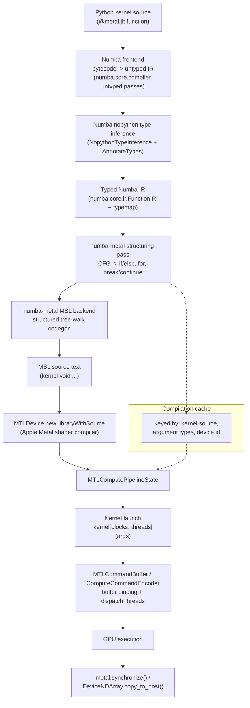

# Architecture

This document describes how numba-metal actually works, based on the
implementation in this repository (not a design proposal). See
`docs/implementation-plan.md` for the investigation record that led to
these decisions.

## Pipeline overview

## Numba frontend integration

numba-metal reuses Numba's real frontend end-to-end: bytecode
disassembly, control-flow reconstruction, and full `nopython`-mode type
inference, exactly as the CPU target does. This happens in
`numba_metal/compiler/frontend.py`, via a custom `CompilerBase` subclass
(`_TypedIROnlyCompiler`) whose pipeline is the standard untyped-IR
pipeline (`DefaultPassBuilder.define_untyped_pipeline`) followed by
`NopythonTypeInference` and `AnnotateTypes` -- and nothing else. No
lowering, no LLVM, no object-mode fallback pass is ever run.

The result is Numba's typed intermediate representation: a
`numba.core.ir.FunctionIR` (a control-flow graph of basic blocks) plus a
`typemap` (`Var name -> Type`) produced entirely by Numba's own type
inference. numba-metal's own code starts only after this point.

### `metal.grid()` / `metal.gridsize()` typing

These are implemented with `numba.extending.intrinsic(prefer_literal=True)`
(`numba_metal/compiler/intrinsics.py`) purely so Numba's type inference
gives them a real, checked signature (an `int32` literal `ndim` argument
mapping to `int64` or `UniTuple(int64, 2)`). Their `codegen` callback --
the half that would normally emit LLVM IR -- is never invoked, because
numba-metal never runs Numba's LLVM lowering. Instead, the MSL backend
pattern-matches `Call` IR nodes whose callee resolves (via a pre-scan of
`Global`/`FreeVar`/`getattr` statements) to these exact function objects,
and emits `thread_position_in_grid`/`threads_per_grid` MSL expressions
directly. This split -- real Numba typing, intercepted lowering -- was
verified empirically against the installed Numba version before being
adopted (see `docs/implementation-plan.md`).

## Typed IR -> MSL lowering

`numba_metal/compiler/msl_backend.py` and
`numba_metal/compiler/structuring.py` implement a structured
tree-walking code generator -- not string substitution on generated text.
It works in two phases:

### 1. Control-flow structuring

Numba's IR is a graph of basic blocks connected by `Branch`/`Jump`
terminators in SSA form (with `phi` nodes at merge points); there is no
"if" or "for" node once the frontend is done. Metal Shading Language, like
C, has no `goto` -- this was verified directly against the Metal compiler
during development, not assumed. So numba-metal reconstructs real
structured control flow from the CFG via a bounded region-based
structurer (`structuring.py`):

- A block ending in `Branch` whose arms reconverge is emitted as
  `if (...) { ... } else { ... }`, with the merge point found via a
  dominance-restricted reachability search.
- A block that is a natural loop header (has a back-edge predecessor
  dominated by the header) is emitted as a loop. The loop's *body region*
  is defined as every block dominated by the loop's body-entry block --
  this dominance-based definition (rather than a naive forward-reachability
  flood-fill) is what correctly distinguishes a `break` target from an
  ordinary post-loop merge block, even when both happen to be reachable
  from inside the loop body (a case the flood-fill approach gets wrong,
  discovered and fixed during this project's own test-driven development).
- If the loop's exit test traces back to a `getiter(range(...))` /
  `iternext` / `pair_first` / `pair_second` chain in the exact shape
  Numba emits for `for x in range(...)`, it is emitted as a native MSL
  `for` loop over the recovered start/stop/step bounds; otherwise it falls
  back to `while (true) { if (exit_cond) break; ... }`.
- Jumps out of the loop's body region are `break`; jumps back to the
  header are `continue`.
- Anything outside these recognized shapes (e.g. a `while` loop with
  side-entry, or genuinely irreducible control flow) raises
  `UnsupportedFeatureError` naming the offending block, rather than
  emitting incorrect MSL.

### 1b. De-SSA: correct phi-node elimination

`numba_metal/compiler/dessa.py` is an isolated pass that eliminates
Numba's SSA `phi` nodes with edge-correct parallel-copy assignments. This
replaced an earlier union-find scheme (aliasing a phi's target and every
incoming SSA variable to one shared MSL identifier) that was
**theoretically unsound**: an incoming SSA variable can remain live after
the merge point through a different name or a different phi chain, and
forcing it to share storage with the phi target means a later write can
silently clobber a value that must stay unchanged (the classic "lost
copy" hazard from SSA-destruction literature -- Briggs et al. 1998;
Boissinot et al. 2009). Differential testing against the union-find
scheme's actual compiled output did not surface a live miscompilation
from *that specific mechanism* (Numba's bytecode frontend happens to
insert temporaries at exactly the points naive coalescing would
otherwise be unsafe, e.g. a tuple swap `x, y = y, x` lowers through a
temporary rather than a direct cross-assignment) -- but that is a
property of the inputs this frontend happens to produce today, not a
guarantee the scheme itself enforced, so it was replaced regardless of
whether a live bug had been demonstrated.

**The algorithm** (see `dessa.py`'s module docstring for the full
rationale):

1. **No aliasing.** Every distinct SSA variable name -- including every
   phi target -- gets its own independent MSL declaration. Nothing is
   ever unioned or collapsed.
2. **Per-edge resolution using Numba's explicit incoming-block data.**
   Numba's phi IR node (`ir.Expr.phi`) carries two parallel arrays,
   `incoming_values` and `incoming_blocks`, with `incoming_values[k]`
   corresponding to `incoming_blocks[k]` by construction (verified
   directly against the installed Numba version's `ir.Expr.phi`
   definition, not assumed). `dessa.py` uses `zip(incoming_values,
   incoming_blocks, strict=True)` exclusively -- never dict iteration
   order, never positional inference from anything else -- to build,
   for every phi, the exact set of `(predecessor_block, value)` pairs
   that must produce an assignment `phi_target := value` if and only if
   control reached the merge via that predecessor.
3. **Structural placement, no explicit edge-splitting data structure.**
   Because the structurer (`structuring.py`) already guarantees a
   *reducible*, structured tree (anything irreducible already raises
   `UnsupportedFeatureError` during structuring, before de-SSA runs),
   every CFG predecessor block appears in exactly one place in the
   structured tree, on exactly one path into the merge. `dessa.py`
   therefore locates that `BasicBlockNode` by its CFG label and the
   backend (`msl_backend.py`'s `_emit_edge_copies`) appends the copy
   immediately after that block's own statements are emitted -- which is
   precisely "the end of the unique control path constituting this
   edge." This sidesteps needing a literal critical-edge-splitting
   transform: the structured tree's shape already resolves "did control
   reach the merge via predecessor P" unambiguously for every reducible
   region, including loop headers (whose two edges -- the pre-loop entry
   and the loop's own back-edge -- are simply two more predecessor
   blocks with their own unique structural locations, one before the
   loop and one inside its body).
4. **Parallel-copy semantics via dependency sequentialization.** When
   multiple phis fire on the same edge (e.g. a loop-carried swap `a, b =
   b, a`, which produces two simultaneous copies on the loop's back-edge),
   naively emitting them in declaration order can read an
   already-overwritten value. `dessa._sequentialize_parallel_copies`
   treats the edge's copy set as a dependency graph (`Copy(target=T,
   source=S)` is an edge `S -> T`), repeatedly emits any copy whose
   target no other pending copy still needs to read, and -- if only
   cycles remain -- breaks one with a synthesized temporary that captures
   the pre-copy value before it would otherwise be overwritten
   (Boissinot et al. 2009's algorithm, applied to the small copy sets --
   typically 1-4 -- phi resolution produces in practice). Each such
   temporary is declared with the MSL type of the value it preserves
   (`MSLKernelLowerer._declare_dessa_temporaries`).
5. **Defensive validation, not silent trust.** `DeSSAPass.run()` accepts
   the structured tree and checks that every phi's incoming block
   actually appears in it; if structuring ever produced a tree that
   dropped a predecessor edge (e.g. a future change to `structuring.py`
   introduces a gap), this raises a specific internal error rather than
   silently placing that edge's copy nowhere.

**A concrete bug this replacement's own test suite found**: building the
required differential tests (`tests/integration/test_phi_dessa.py`,
covering phi-target liveness, same-edge multi-phi, parallel-copy swaps,
copy cycles, nested if/else, ternaries, loop-carried accumulation, nested
loops, break/continue interactions, multi-way merges, and positive/negative
range steps) surfaced a real, previously untested bug in a *different*
mechanism: nested `for`-range loops could have the inner loop's
iterator-protocol-name suppression (which hides Python's
getiter/iternext/pair_first/pair_second bookkeeping from MSL output, a
mechanism unrelated to phi elimination) walk through the outer loop's
already-suppressed `getiter` result and incorrectly suppress the outer
loop's own induction variable, producing MSL referencing an undeclared
identifier. That was fixed by scoping each loop's suppression scan to
only its own `range()` call site (`_suppress_loop_protocol_names`), not
the whole function. This is documented here as a concrete demonstration
of why every correctness claim in this codebase is backed by an
executable test against real Metal execution, not an argument alone.

### 2. Statement/expression codegen

Each Numba IR statement (`Assign`, `SetItem`, `StaticSetItem`) and
expression (`binop`, `unary`, `call`, `getitem`, `getattr`, `cast`, ...)
is walked and translated to one MSL statement/expression via a fixed
dispatch table (`numba_metal/compiler/msl_backend.py`). Every operation
not in the supported table raises `UnsupportedFeatureError` naming the
specific IR node, operator, or type -- this is enforced by
`tests/test_unsupported.py`.

Local variables are all declared up front, at function scope (flat, not
block-scoped), from the typemap -- this mirrors how Numba's own SSA form
already treats every `Var` as function-scoped, and sidesteps MSL's
declare-before-use requirement without needing separate scope tracking.

## Deliberate precision decisions

- **float64 narrowing.** Python float literals and `/` true-division
  infer as `float64` under ordinary Numba typing (matching CPython),
  but MSL's `float` is 32-bit and Apple GPU float64 support is not
  verified. numba-metal narrows *local intermediate* float64 values to
  `float32` rather than reject every kernel containing a literal or a
  division; float64 *array dtypes or kernel arguments* remain strictly
  rejected. See `docs/limitations.md` for the numerical consequences,
  discovered concretely while validating the Mandelbrot benchmark (a
  float64 CPU reference and a float32 GPU result diverged near the
  chaotic escape boundary purely from this precision difference, not
  from any codegen bug -- fixed by making the benchmark's CPU reference
  float32 too, for a fair comparison).
- **Fast-math disabled.** `MTLCompileOptions.fastMathEnabled` is
  explicitly set to `False` for all kernel compilation
  (`numba_metal/compiler/pipeline.py`). Metal's default fast-math mode
  permits FMA fusion and reassociation that is invisible for most
  kernels but was observed, during this project's own benchmark
  development, to shift Mandelbrot escape-iteration counts for a
  small fraction of pixels relative to standard (non-fused) float32
  semantics. Disabling it trades a small amount of performance for
  results that match ordinary float32 arithmetic more closely.
- **Integer `//`.** MSL's native integer division truncates toward zero;
  Python's `//` floors toward negative infinity. These agree for
  non-negative operands (the only case exercised by the five benchmark
  kernels, which use `//` for non-negative flattened-index arithmetic)
  and are documented to differ for negative operands.

## Runtime compilation and kernel cache

`numba_metal/compiler/pipeline.py`'s `KernelCache` maps a cache key --
SHA-256 of the kernel's source text (`inspect.getsource`), qualified
name, argument-type tuple, and the Metal device's `registryID` -- to a
`CompiledKernel` (deterministic generated kernel name, MSL source, an
`MTLComputePipelineState`, and metadata needed for argument binding). A
cache hit skips both the Numba typed-IR frontend and Metal shader
compilation entirely. The cache is in-process, in-memory only; there is
no on-disk persistent cache in the MVP (see `docs/roadmap.md`).

Kernel names are deterministic per compilation (`nbmtl_<funcname>_<n>`,
with `n` from a process-wide monotonic counter), so repeated dumps via
`NUMBA_METAL_DUMP_MSL=1` are stable and identifiable.

## Metal device and queue management

`numba_metal/runtime/context.py` holds one process-wide `MTLDevice` and
one `MTLCommandQueue`, created lazily on first use
(`numba_metal.runtime.device.check_capable()` runs the full
platform/device/toolchain validation before anything is created). This is
the one piece of module-level mutable state in the package; it mirrors
how essentially every GPU runtime (CUDA included) treats the device and
queue as process-wide resources, and was chosen over threading a context
object through every public call for no practical benefit in a
single-GPU MVP.

## Buffer ownership and memory model

Device arrays (`numba_metal/runtime/array.py`, `DeviceNDArray`) are
backed by `MTLResourceStorageModeShared` buffers. On Apple silicon's
unified memory architecture, these buffers are directly addressable from
both CPU and GPU -- there is no discrete VRAM to copy across via a
PCIe-style transfer. However, `to_device()`/`copy_to_host()` currently
still perform a host-side `memcpy` into/out of the `MTLBuffer`'s own
backing memory (via `buf.contents().as_buffer(...)`), because a NumPy
array and an `MTLBuffer` are distinct allocations in the current
implementation. This is **not** zero-copy, and is documented honestly as
such rather than described as "unified memory" magic. A true zero-copy
path -- wrapping an existing NumPy allocation's memory directly via
`MTLDevice.newBufferWithBytesNoCopy_length_options_deallocator_` -- is
legal Metal API surface and is listed in `docs/roadmap.md`, deferred from
the MVP to keep buffer lifetime rules simple (Python's own reference
counting owns the `MTLBuffer` for the `DeviceNDArray`'s lifetime; a
no-copy wrapper would need to additionally keep the source NumPy array
alive for as long as the GPU might reference its memory).

### Host/device synchronization model (Workstream 3)

Because a shared-storage-mode buffer's memory is the *same* memory on
both sides, a host-side read or write that runs concurrently with an
outstanding GPU kernel touching that memory is a genuine data race, not
merely a staleness concern -- the GPU could read a half-written host
update, the host could read a value the GPU hasn't finished computing, or
both could write concurrently. This was confirmed empirically, not just
reasoned about: with the synchronization call described below removed
for testing, a kernel reading a buffer across roughly 2000 iterations,
immediately followed by an unsynchronized host-side overwrite of that
same buffer, was observed to have the kernel's *actual measured output*
reflect the new, overwritten values instead of the values present at
launch time -- i.e. the host write measurably raced ahead of and
corrupted the in-flight kernel's input (see
`tests/integration/test_host_device_sync.py`, and its regression against
this exact failure mode).

The MVP's model is deliberately conservative rather than a fine-grained
per-buffer dependency tracker: **every** `DeviceNDArray.copy_to_host()`
call and **every** `DeviceNDArray.copy_to_device()` call (including the
write inside `to_device()`) unconditionally calls `metal.synchronize()`
first -- waiting for *all* currently outstanding command buffers (see
"Command-buffer tracking and error propagation" above), not just ones
that happen to reference the specific buffer being touched. This is
coarser than strictly necessary (a `copy_to_host()` on buffer A will also
wait for an unrelated in-flight kernel touching only buffer B), but it is
unconditionally correct without needing to build and maintain a
per-buffer dependency tracker, which was judged out of scope for this
pass in favor of a design that is simple enough to be confidently
correct. A consequence worth being explicit about: every `copy_to_host()`
or `copy_to_device()` call is a synchronization boundary, full stop --
this is also what makes `copy_to_host()` a reliable place to observe a
preceding kernel's GPU-side failure (see the command-buffer tracking
section above): it cannot return partial or in-flight data that would
mask a `MetalRuntimeError` a synchronize() would otherwise raise.

## Dispatch and synchronization

`numba_metal/runtime/dispatcher.py`'s `KernelDispatcher` implements
`kernel[blocks, threads](*args)`: it infers each argument's Numba type
(device array dtype -> 1D array type; NumPy/Python scalar -> scalar
type), gets-or-compiles the matching `CompiledKernel` from the cache,
binds buffers (each array argument gets its own buffer slot plus a
hidden trailing `uint` element-count buffer, used to implement `.size`;
each scalar argument gets its own small constant buffer), and encodes a
`dispatchThreads:threadsPerThreadgroup:` call on a fresh command buffer
from the shared queue, then commits it.

### Command-buffer tracking and error propagation

Every dispatched command buffer is registered with the process-wide
`_MetalContext` as a `SubmissionRecord` (`context.py`): kernel name, the
command buffer object itself, every Metal resource the dispatch used
(argument array buffers, synthesized scalar/size constant buffers, the
pipeline state) retained for the buffer's outstanding lifetime, a
monotonic submission sequence number, and the generated MSL source for
diagnostics.

`metal.synchronize()` waits on **every** currently outstanding command
buffer (not a single barrier), then inspects each one's
`status()`/`error()` individually and raises `MetalRuntimeError` naming
the specific failing kernel and submission number. This replaced an
earlier design that committed one empty "barrier" command buffer and
waited only on that, relying on the single serial `MTLCommandQueue`'s
in-order execution to *infer* everything earlier had also finished --
which established ordering correctly but never inspected the status of
the actual kernel command buffers, so a kernel-level Metal error could be
silently discarded as long as the (trivially always-successful, since it
has no work) barrier itself completed. Two properties this rules out
specifically: an earlier failure cannot be hidden by a later, unrelated
buffer completing successfully (every outstanding buffer is checked, not
just the most recent), and a failure is never inferred by catching a
Python exception raised inside an `addCompletedHandler_` callback --
Metal invokes completion handlers on its own internal dispatch queue, and
an exception raised there does not propagate to the Python thread that
called `synchronize()`; status/error are instead read synchronously,
in-thread, immediately after `waitUntilCompleted()` returns.

`synchronize()` drains its whole pending list atomically (under a
dedicated lock separate from the one-time device-init lock) before
waiting on any of it, so repeated calls -- including a second
`synchronize()` immediately after one that raised -- are safe: there is
nothing left to re-wait on, and no deadlock risk from waiting twice on an
already-completed buffer.

A deliberately, deterministically failing *real* Metal submission could
not be safely constructed for testing this: out-of-bounds GPU memory
access is undefined behavior on Apple GPUs and was verified empirically
(during this project's own development) not to reliably surface as a
command-buffer error status, so relying on it would itself be an
unsafe, non-reproducible test. Failure-status handling is therefore
unit-tested against a fake command-buffer object with a fully scripted
`status()`/`error()`
(`tests/unit/test_command_buffer_tracking.py`), and the success path
(multiple real launches tracked and cleanly drained, resource lifetime
across real async completion) is separately verified on real Metal
hardware (`tests/integration/test_command_buffer_tracking_metal.py`).

## Error handling

All user-facing failures raise one of the dedicated exception types in
`numba_metal/errors.py` (`UnsupportedPlatformError`,
`MetalToolchainError`, `UnsupportedFeatureError`, `KernelCompilationError`,
`KernelLaunchError`, `MetalRuntimeError`), never a bare `Exception`, and
error messages always name the specific offending construct/dtype/value
rather than a generic failure. `KernelCompilationError` for a Metal
shader-compilation failure includes both the Metal compiler's own
diagnostic text and the full generated MSL source, so a failure is always
debuggable without re-running with `NUMBA_METAL_DUMP_MSL=1`.

## Relevant Numba extension points and private APIs used

| API | Public/private | Why it's needed |
|---|---|---|
| `numba.core.compiler.CompilerBase`, `DefaultPassBuilder` | Semi-public (documented as an extension point, but its exact pass-list shape is compiler-internal) | Build a pipeline that runs the untyped frontend + type inference and stops there |
| `numba.core.compiler_machinery.{PassManager, FunctionPass, register_pass}` | Semi-public | Insert a custom terminal pass (`_CaptureTypedIR`) that copies what's needed out of Numba's internal `state` object |
| `numba.core.typed_passes.{NopythonTypeInference, AnnotateTypes}` | Internal (`numba.core.typed_passes` has no stability guarantee across releases) | The actual type-inference passes reused |
| `numba.core.registry.cpu_target` | Semi-public | Typing/target context source; numba-metal does not register its own Numba target via `numba.core.target_extension` (see "Alternatives considered") |
| `numba.extending.intrinsic(prefer_literal=True)` | Public | Type `metal.grid()`/`gridsize()` |
| `numba.core.ir.*` (`Assign`, `Expr`, `Branch`, etc.) | Public-ish (documented as the IR data model, but full grammar isn't a stability-guaranteed API) | Walking the typed IR |

`numba_metal/compiler/frontend.py` is a small, deliberately isolated
adapter module -- everything above is imported only there and in
`msl_backend.py`/`structuring.py`, not scattered through the codebase, so
a future Numba version's changes are localized to a known surface.

## Alternatives considered

**Register a `"metal"` target via `numba.core.target_extension` and
implement `@lower`-based lowering, like `numba.cuda`'s
`CUDACompiler`/NVVM path.** Rejected for the MVP: that machinery exists
specifically to let multiple backends share Numba's generic
`@overload`/`@lower` registries and ultimately hand *LLVM IR* to
`numba.core.codegen`. Metal Shading Language is text, not LLVM IR, and
Apple's `air64` LLVM dialect is not something llvmlite/Numba know how to
target; reverse-engineering AIR bitcode emission to reuse this path was
judged out of scope for an MVP. Adopting `target_extension` registration
without also using its lowering half would add real version-fragility
(these are internal-ish APIs that move between Numba releases) for no
benefit, since numba-metal's actual backend is a bespoke IR-to-text
walker regardless.

**Emit MSL via string templates / f-string substitution keyed on source
text patterns.** Rejected outright, including as a fallback: this is
explicitly disallowed by the project's requirements (no unconstrained
string-replacement code generation) and would not survive even trivial
kernel variations. The structured tree-walk over typed IR is the only
approach implemented.

**Emit a goto-based MSL translation of the raw CFG.** Investigated and
rejected after directly testing that Metal's shader compiler rejects
`goto`/labeled statements (`"labeled statements are not supported in
Metal"` / `"'goto' is not supported in Metal"`), which is what motivated
building the structured-control-flow reconstruction described above
instead.

**numba/numba#5706.** Read in full during Workstream 7 (see
`docs/numba-rfc.md`), after the architecture above had already been
built -- so it did not influence any implementation decision in this
codebase, but it does independently corroborate the "Why this
architecture" rationale below: Numba maintainers and contributors
discussing that issue over several years (2020-2025) repeatedly
concluded there is no known way to target Metal from Numba's LLVM IR
(no public AIR/air64 backend, no documented Metal Shader Converter path
from arbitrary LLVM IR), and explicitly characterized a real solution as
"a research project," not an incremental addition. This matches the
"MSL is text, not an LLVM target" conclusion this project reached
independently. See `docs/numba-rfc.md` for the full findings and
`docs/upstream-strategy.md` for what this implies about staying an
out-of-tree, non-`target_extension`-registered backend.

## Why this architecture

The governing constraint is that MSL is a restricted C++14-derived text
language, not an LLVM target -- so any approach that tries to reuse
Numba's LLVM-based lowering infrastructure either doesn't apply (no LLVM
backend for AIR exists) or would require building one (out of scope for
an MVP). Given that, the smallest *honest* pipeline is: reuse everything
in Numba that produces validated, typed IR (frontend + type inference,
which is by far the most complex and highest-value part of "does this
Python code typecheck as a GPU kernel"), and write a small, dedicated,
testable backend for the one thing Numba can't help with -- turning that
IR into MSL text. This kept the amount of Numba-internal-API surface
touched to a minimum (isolated in `frontend.py`) while avoiding any
string-templating code generation.
